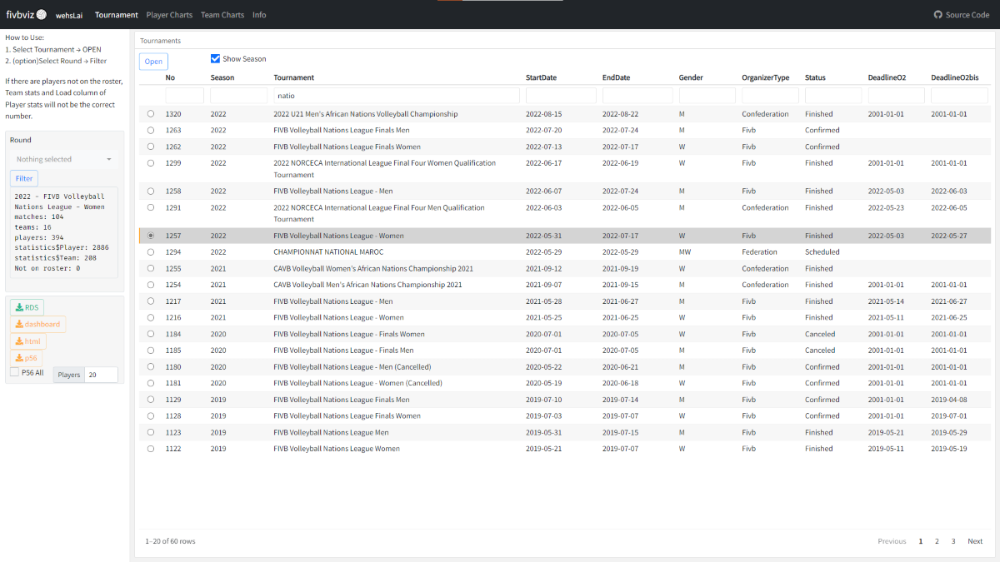
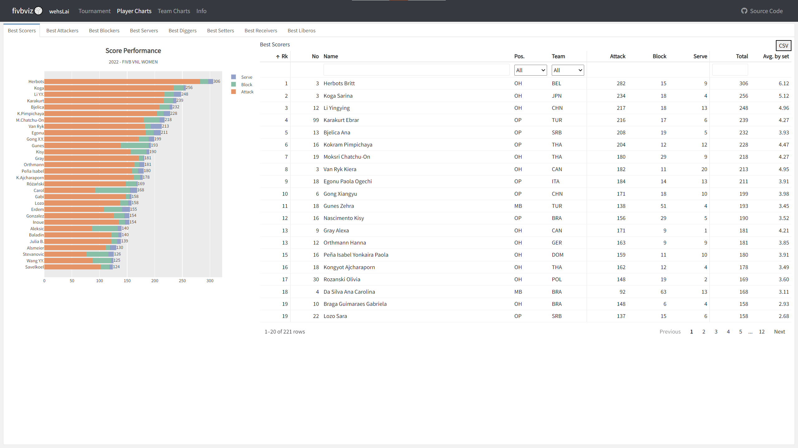
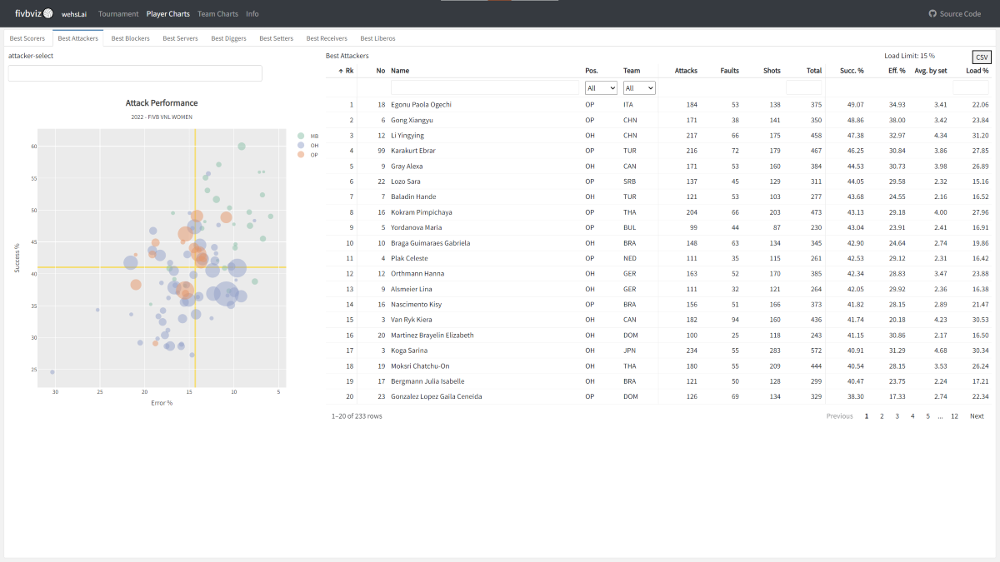
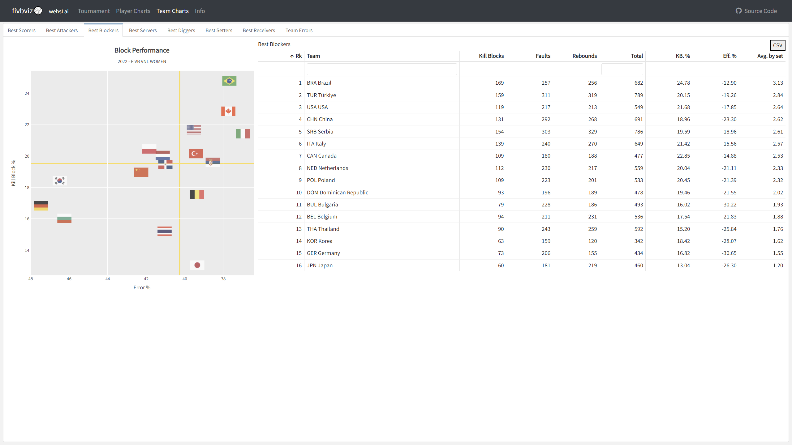
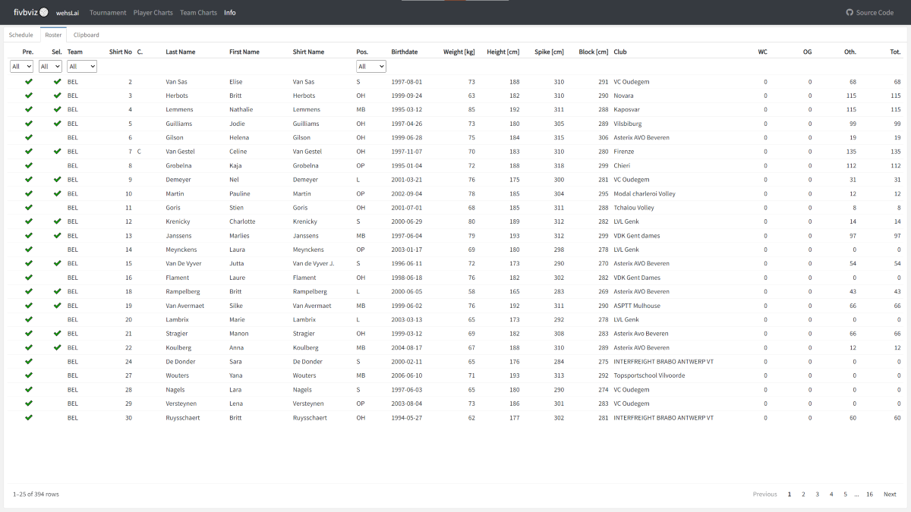

# fivbviz

Shiny dashboard for visualizing FIVB volleyball data.

**Important!** Using package [wehsLai/fivbvis](https://github.com/wehsLai/fivbvis) instead of openvolley/fivbvis

## Screenshot

